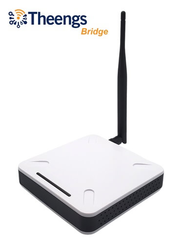

# Applications and MQTT gateways

**Theengs** is available with the hardware below. They can work independently or together, following your requirements.

## Features
|Product| Platform |Retrieve and decode broadcasts |MQTT integration| Home Assistant convention discovery| Presence detection | Display| Can connect with raw data|
|-|:-:|:-:|:-:|:-:|:-:|:-:|:-:|
|[Theengs Bridge](https://shop.theengs.io/products/theengs-bridge-esp32-ble-mqtt-gateway-with-ethernet-and-external-antenna)|ESP32|☑️|☑️|☑️|☑️|-|☑️|
|[Theengs Plug](https://shop.theengs.io/products/theengs-plug-smart-plug-ble-gateway-and-energy-consumption)|ESP32|☑️|☑️|☑️|☑️|-|☑️|
|[Theengs App](https://app.theengs.io)|iOS/Android|☑️|☑️|☑️|-|☑️|-|
|[OpenMQTTGateway](https://shop.theengs.io/products/theengs-plug-smart-plug-ble-gateway-and-energy-consumption)|ESP32|☑️|☑️|☑️|☑️|-|☑️|
|[Theengs Gateway](https://gateway.theengs.io)|PC/Mac/Servers|☑️|☑️|☑️|☑️|-|-|

## On our bridge
The [Theengs bridge](https://shop.theengs.io/products/theengs-bridge-esp32-ble-mqtt-gateway-with-ethernet-and-external-antenna) is a powerfull  BLE to MQTT gateway for over [80 sensors](https://decoder.theengs.io/devices/devices.html). Equipped with an Ethernet port, and external antenna, ensuring an enhanced range for your BLE sensors. It supports also WiFi connectivity.

  

## On our smartplug
The [Theengs plug](https://shop.theengs.io/products/theengs-plug-smart-plug-ble-gateway-and-energy-consumption) is a versatile device that can serve as a BLE to MQTT gateway for over [80 sensors](https://decoder.theengs.io/devices/devices.html), as well as a smart plug with power consumption measurement and presence detection features.

  

## On a smartphone or tablet
The [Mobile/Tablet Android and iOS/iPadOS application](https://app.theengs.io) enables to read the sensors data directly.

It can act also as a BLEtoMQTT gateway.

## On a microcontroller
Theengs is used by [OpenMQTTGateway](https://docs.openmqttgateway.com), it can be installed [easily](https://docs.openmqttgateway.com/upload/web-install.html) on an ESP32 to act as a Bluetooth to MQTT gateway.

  

## On a computer
Alternatively Theengs can be used on computers and servers as a [python BLEtoMQTT gateway](https://gateway.theengs.io) for Raspberry Pi, Unix, or Windows,

  

## Integrations
Theengs products can be integrated with smart home and IoT controllers supporting MQTT:
* [OpenHAB](https://www.openhab.org)
* [Home Assistant](https://www.home-assistant.io)
* [Domoticz](https://www.domoticz.com)
* [Jeedom](https://www.jeedom.com)
* [Node Red](https://nodered.org)
* [FHEM](https://fhem.de)

::: warning Note
All product and company names are trademarks or registered trademarks of their respective holders. Use of them does not imply any affiliation with or endorsement by them.
:::

::: slot footer
[GPLv3 Licensed](https://github.com/theengs/home/blob/main/LICENSE) | Copyright © 2023-present Theengs
:::
