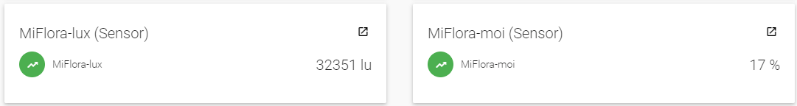
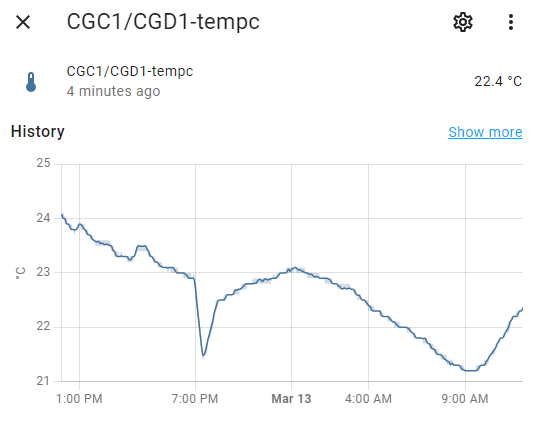
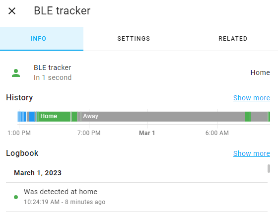
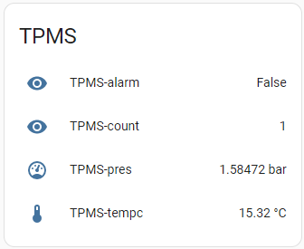

Theengs is a powerful technology platform that allows seamless integration between various smart home devices, providing enhanced functionality and convenience. Here, we'll explore how Theengs can be used to improve energy efficiency, enhance security, automate routine tasks, and more. 

Whether you're a homeowner or a tech enthusiast, this page is the perfect resource to explore the exciting world of Theengs and its applications for smart homes.

:::tip What you need
A [BLE sensor](https://decoder.theengs.io/devices/devices_by_brand.html) depending on your use cases + [OpenMQTTGateway](https://docs.openmqttgateway.com) OR [Theengs Gateway](https://gateway.theengs.io), an MQTT broker, and a Controller.

If you want to access real-time data from the sensors without a controller and a broker, you can also use the [Theengs App](https://app.theengs.io)
:::

### Monitor your favorite plan with a Mi Flora BLE sensor to know when it needs water

  

### Trigger a fan depending on the temperature and humidity thanks to a CGD1 BLE sensor

  

### Follow your meat temperature when cooking with an Inkbird IBBQ

### Alert yourself by a controller notification if the temperature of a fridge or freezer is too high

<video width="560" height="240" controls>
  <source src="../img/theengs-temperature-too-high.mp4" type="video/mp4">
  Your browser does not support the video tag.
</video> 

### Detect a beacon/smartwatch to trigger a special scenario when you come home

  

### Lose weight with the help of a complete log system

<iframe width="560" height="315" src="https://www.youtube.com/embed/noUROhtf0E0" frameborder="0" allow="autoplay; encrypted-media" allowfullscreen></iframe>

### Detect opened doors or windows and alert yourself when leaving

### Monitor vehicle tire pressure

  

